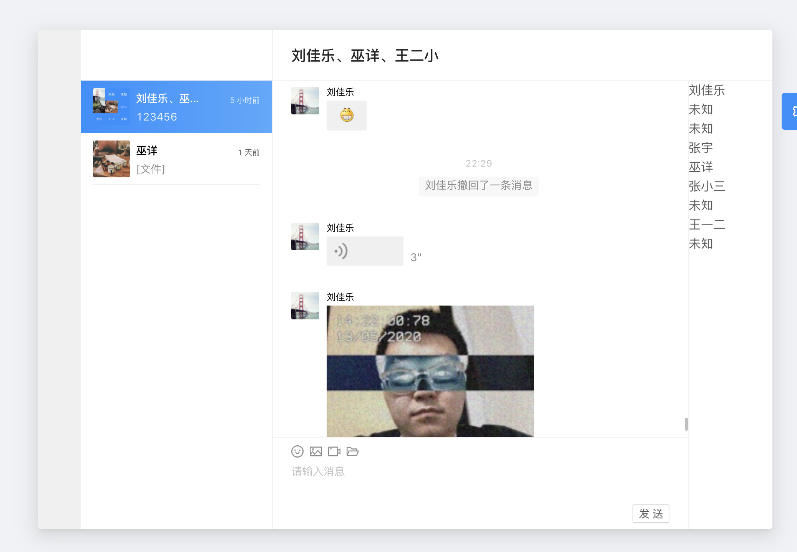

# react-tim-chat



基于腾讯IM v2.6.5的React聊天简易实现，数据流使用rematch，功能如下

- 群聊，单聊
- 图片、视频、文件、文字、表情消息的渲染和发送，语音消息的渲染
- 系统消息渲染
- 下拉加载更多消息
- 群成员列表
- 消息撤回

## 使用

``` sh
git clone https://github.com/zhangyu1818/react-tim-chat.git
cd react-tim-chat
npm i
npm run dev
```

需要先修改`example/index.jsx`内的`SDKAppID`和`userID`

本来想做好一个完整的腾讯IM，再打成`npm`包，然而自己菜的绝望，所以放弃了